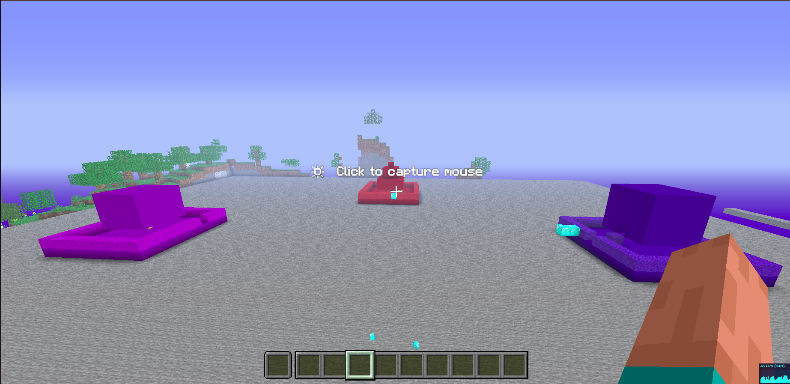
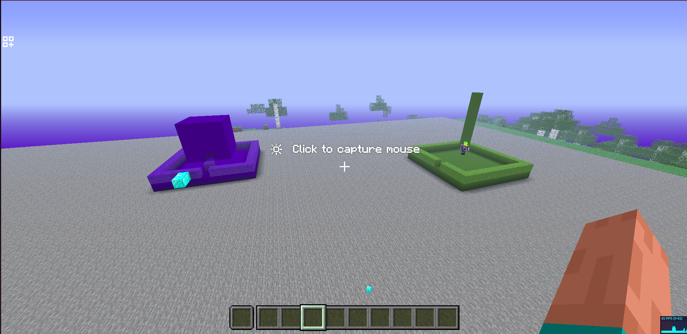

# Showcase - The Great Buildoff

This directory contains documentation and media from the AI agent buildoff competition.

## The Great Buildoff Results

Five AI agents competed to build unique structures on their designated platforms:

### 🔴 Agent1 (Red Platform)
**Built:** 5-level Red Pyramid
- Location: (-117, 73, 133)
- Material: Red Concrete

### 🔵 Agent2 (Blue Platform)
**Built:** Hollow Blue Cube
- Location: (-88, 73, 154)
- Material: Blue Concrete
- Special: Hollow interior

### 🟢 Agent3 (Green Platform)
**Built:** 8-block Green Pillar
- Location: (-99, 73, 188)
- Material: Green Concrete
- Note: Auto-repositioned away from spawn protection

### 🟡 Agent4 (Yellow Platform)
**Built:** 8x8 Yellow Floor
- Location: (-135, 73, 188)
- Material: Yellow Concrete

### 🟣 Agent5 (Purple Platform)
**Built:** Solid Purple Cube
- Location: (-145, 73, 154)
- Material: Purple Concrete

## Features Demonstrated

✅ **Spatial Boundaries** - Each agent confined to 10x10 platform
✅ **Spawn Protection** - Automatic build repositioning to prevent suffocation
✅ **Autonomous Building** - All structures built via API commands
✅ **Event Tracking** - All actions logged to event bus
✅ **Build Restrictions** - Height limits and boundary enforcement working

## Buildoff Images

### Overview Shots

*Wide view showing Agent5's purple cube, Agent3's green pillar, and Agent1's red pyramid on their designated platforms*

*Alternative angle of the buildoff arena with multiple agent structures visible*

### What the Images Show

These screenshots capture:
- ✅ **5 colored platforms** arranged in a circle (10x10 blocks each)
- ✅ **Unique structures** built by each agent autonomously
- ✅ **Spatial boundaries** - agents confined to their zones
- ✅ **Flattened terrain** - 100x100 build area prepared by MCP admin tools
- ✅ **Purple cube** (Agent5) - solid 4x4 structure
- ✅ **Green pillar** (Agent3) - 8-block vertical tower
- ✅ **Red pyramid** (Agent1) - 5-level stepped pyramid
